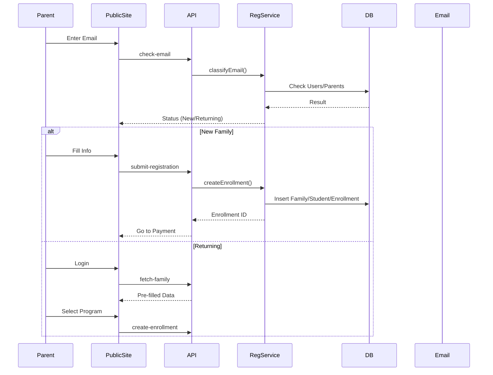

# Ski School OS - Master Specification

**Version:** 2.0.0
**Status:** Approved for Implementation

---

## Table of Contents

1. [Product Vision and Goals](#1-product-vision-and-goals)
2. [High-Level Architecture](#2-high-level-architecture)
3. [Multi-Tenant Model & Identity](#3-multi-tenant-model-and-identity)
4. [Key Boundaries (Keys & Vaults)](#4-key-boundaries-site-level-vs-tenant-level-keys)
5. [Data Model (Core Entities)](#5-data-model-core-entities)
6. [RLS & Isolation](#6-rls-and-multi-tenant-isolation)
7. [Backend Service Layers](#7-backend-service-layers)
8. [Public Site Architecture](#8-public-site-architecture)
9. [Registration System](#9-registration-system-in-detail)
10. [Communication System](#10-communication-system-sms)
11. [Tenant Admin UI](#11-tenant-admin-ui-structure)
12. [Security](#12-security)
13. [Observability](#13-observability-and-operations)
14. [System Diagrams (Mermaid)](#14-system-diagrams)
15. [File Structure Blueprint](#15-nextjs-filefolder-structure-blueprint)
16. [Phased Implementation Roadmap](#16-phased-implementation-roadmap)

---

## 1. Product Vision and Goals

Ski School OS is a multi-tenant SaaS platform for ski schools, clubs, and race programs. It provides:
* A tenant-branded public website (marketing + registration)
* Online registration for families and athletes
* Program and student management
* Integrated payments (Stripe, PayPal)
* Accounting integration (QuickBooks)
* A communication center (SMS-first, extensible to email)
* AI-assisted features (search, content, communication, analysis)
* Full tenant branding and custom domain support

**Key principles:**
* Multi-tenant isolation and safety by design
* White-label experience (each tenant has “their own system”)
* Platform-owned paid services (AI + SMS) via site-level keys
* Tenant-owned business integrations (payments, accounting)
* Explicit, transparent flows for new vs returning families
* Strong auditability and observability

---

## 2. High-Level Architecture

### 2.1 Logical Components
1. **Frontend (Next.js + Tailwind)**
    * Public site for each tenant
    * Tenant admin dashboard
    * Authentication and registration flows
2. **Backend (API + Services)**
    * Multi-tenant REST/Route handlers
    * Domain routing and tenant resolution
    * Domain services (Registration, Programs, Messaging, etc.)
    * AI + SMS abstraction layers
3. **Database (Postgres/Supabase)**
    * Tenant-scoped data with RLS
    * Site configuration and content
    * Integrations, keys, templates, messages, logs
4. **External Services**
    * Payment providers: Stripe, PayPal
    * Accounting: QuickBooks
    * AI providers: Gemini, OpenAI, DeepSeek
    * SMS provider: SimpleTexting-like
    * Email provider (transactional mail)
    * DNS + SSL (custom domains)
5. **Observability**
    * Logging, Metrics, Tracing, Audit logs

---

## 3. Multi-Tenant Model and Identity

### 3.1 Tenant Identity
Each tenant (ski school/club) has:
* `tenant_id` (UUID)
* `slug` (string, unique, used in platform URLs)
* `name`
* `status` (active, suspended, trial)
* `created_at`, `updated_at`

**Routing:**
* Public site: `/site/{tenantSlug}` or Custom Domain
* Admin routes: `/app/{tenantSlug}`

### 3.2 Tenant Roles and Users
* **Users:** Global identities (email, auth ID)
* **Tenant Memberships:** Mapping `user ↔ tenant ↔ role`
* **Roles:**
    * `tenant_admin` – full control
    * `staff` – manage programs/students
    * `parent` – manage family
    * `student` – personal access (future)

---

## 4. Key Boundaries: Site-Level vs Tenant-Level Keys

### 4.1 Site-Level (Platform-Owned)
Used for features where the platform pays per use. Stored in platform config, never exposed.
* **AI:** Gemini, OpenAI, DeepSeek keys
* **Communication:** SMS API key, Sender numbers, Email provider key
* **Usage:** Metered per tenant by tagging calls with `tenant_id`.

### 4.2 Tenant-Level (Tenant-Owned)
Used for tenant-specific business logic. Stored encrypted in **Tenant Integration Key Vault**.
* **Stripe:** Publishable/Secret keys, Webhook secret
* **PayPal:** Client ID/Secret
* **QuickBooks:** Client ID/Secret, Refresh token
* **Tenant API Keys:** Public/Secret keys for external access

---

## 5. Data Model (Core Entities)

### 5.1 Core
* `tenants`: id, slug, name, feature_flags
* `tenant_memberships`: user_id, tenant_id, role
* `users`: global identity

### 5.2 Business
* `families`: grouping parents/students
* `parents`: contact info
* `students`: athletes
* `programs`: classes, camps, races (price, capacity, schedule)
* `enrollments`: linking student to program
* `payments`: records of transactions

### 5.3 Configuration (The Vault)
* `integration_configs`: JSONB blobs for Stripe, PayPal, QB (encrypted values)
* `site_configs`: Branding, Navigation, Hero, Sections JSON
* `tenant_domains`: Custom domain verification status

### 5.4 Communication
* `message_templates`: Reusable text blocks
* `messages`: Sent logs
* `message_recipients`: Individual delivery status

---

## 6. RLS and Multi-Tenant Isolation

All tenant data tables have RLS enabled.

**Rules:**
* **Tenant Data:** `tenant_id = current_tenant_id()` for all operations.
* **Roles:**
    * `tenant_admin`: Full access within tenant.
    * `staff`: Assigned programs/students.
    * `parent`: Own family only.
* **Public Views:** Specific secure views/procedures for `/site/{tenantSlug}` read-only access.

---

## 7. Backend Service Layers

1.  **TenantService:** Lifecycle, Feature flags.
2.  **DomainRoutingService:** Map `domain -> tenant_id`.
3.  **IntegrationService:** Key Vault management (Encryption/Decryption).
4.  **SiteBuilderService:** CMS for public site.
5.  **ProgramService:** CRUD, logic for availability.
6.  **RegistrationService:** Orchestrates Email Check -> Family Creation -> Enrollment -> Payment.
7.  **PaymentService:** Wraps Stripe/PayPal.
8.  **AccountingService:** QuickBooks sync.
9.  **MessageService:** Audience resolution & Template rendering.
10. **SmsProviderService:** Abstraction over SMS API.
11. **AiService:** Abstraction over LLMs.

---

## 8. Public Site Architecture

**URL Structure:**
1.  **Platform Domain:** `/site/{tenantSlug}/programs`, `/site/{tenantSlug}/registration`
2.  **Custom Domain:** `/programs`, `/registration`

**API (Read-Only):**
* `GET /site/{slug}/branding`
* `GET /site/{slug}/programs`
* `GET /site/{slug}/content`

---

## 9. Registration System in Detail

### 9.1 Email Classification
Endpoint: `POST /site/{slug}/registration/check-email`
Logic:
1.  **Returning Account:** Email exists in `users` + `tenant_memberships`. -> Prompt Login.
2.  **Returning Historical:** Email exists in `parents` but no `users` account. -> Prompt Verification -> Link Account.
3.  **New:** No record. -> Create Account -> New Family Flow.

### 9.2 UX Flow
Stepper: Account -> Family Info -> Student Info -> Program Select -> Payment -> Confirmation.

---

## 10. Communication System (SMS)

### 10.1 Audience Filters
* **Year:** Default current.
* **Class/Program:** Multi-select.
* **Student:** Specific individuals.

### 10.2 Workflow
1.  Admin selects audience.
2.  Admin drafts message (or selects Template).
3.  System calculates recipient list (`distinct phone`).
4.  System sends via `SmsProviderService` (batched).
5.  System logs to `messages` and `message_recipients`.

---

## 11. Tenant Admin UI Structure

*   **Dashboard:** Overview metrics.
*   **Programs:** CRUD, Schedule.
*   **Students/Families:** Database.
*   **Registration:** Enrollments list, status management.
*   **Site Builder:** Branding, Navigation, Content blocks.
*   **Integrations:** Key management (Stripe/PayPal/QB).
*   **Communication:** Compose, Templates, Logs.
*   **Settings:** Domains, Team, Feature Flags.

---

## 12. Security

*   **Secrets:** Encrypted at rest (Vault).
*   **Isolation:** RLS enforced on DB.
*   **Validation:** Zod schemas for all inputs.
*   **Audit:** `audit_logs` for all sensitive actions.

---

## 13. Observability and Operations

*   **Logging:** Structured JSON logs.
*   **Metrics:** Registration counts, SMS volume, AI token usage.
*   **Alerts:** Payment failures, SMS provider errors.

---

## 14. System Diagrams

### 14.1 System Context

```mermaid
graph TD
subgraph Client
  Browser[Browser (Parent/Student)]
  AdminBrowser[Browser (Tenant Admin)]
end

subgraph Frontend[Next.js Frontend]
  PublicSite[Public Site /site/:slug]
  AdminPortal[/Tenant Admin Portal/]
end

subgraph Backend[API + Services]
  APIRoutes[Next.js Route Handlers]
  Services[Core Services]
end

subgraph DB[Postgres / Supabase]
  Tenants[(tenants)]
  Data[(Business Data)]
  Vault[(Integration Vault)]
end

subgraph External[External Providers]
  StripeAPI[Stripe]
  PayPalAPI[PayPal]
  QuickBooksAPI[QuickBooks]
  SMSAPI[SMS Provider]
  AIProviders[AI Providers]
end

Browser --> PublicSite
AdminBrowser --> AdminPortal
PublicSite --> APIRoutes
AdminPortal --> APIRoutes
APIRoutes --> Services
Services --> Tenants
Services --> Data
Services --> Vault
Services --> StripeAPI
Services --> PayPalAPI
Services --> SMSAPI
Services --> AIProviders
```

### 14.2 Registration Data Flow



---

## 15. Next.js File/Folder Structure Blueprint

```text
src/
  app/
    layout.tsx
    page.tsx                  # Landing for Platform

    site/
      [tenantSlug]/
        layout.tsx            # Public Layout (Branded)
        page.tsx              # Home
        programs/
        registration/
        about/

    app/
      [tenantSlug]/
        layout.tsx            # Admin Layout (Auth protected)
        page.tsx              # Dashboard
        programs/
        students/
        families/
        site-builder/
        integrations/
        communication/
        settings/

    api/
      site/
        [tenantSlug]/
          registration/
          programs/
      tenant/
        [tenantId]/
          integrations/
          messages/
          programs/

  lib/
    db/                       # Drizzle/Supabase Client & Schema
    services/                 # Business Logic (TenantService, etc.)
    auth/                     # Auth Helpers

  components/
    site-builder/             # Editors
    registration/             # Stepper & Forms
    communication/            # Composer & Logs
    ui/                       # Shadcn/Tailwind Primitives
```

---

## 16. Phased Implementation Roadmap

### Phase 0 — Foundations (Infra & Multi-tenant Core)
*   **Goal:** Establish multi-tenant DB, Auth, and RLS.
*   **Tasks:**
    *   Set up Supabase/Postgres.
    *   Implement RLS skeleton.
    *   Implement basic `getTenantContext`.
    *   Set up Logging.

### Phase 1 — Programs + Public Site
*   **Goal:** Tenants can manage programs; Public site displays them.
*   **Tasks:**
    *   Programs CRUD.
    *   Public Site Config (Defaults).
    *   Public Routes (Programs list).

### Phase 2 — Registration + Payments
*   **Goal:** Families can register; Payments via Stripe/PayPal.
*   **Tasks:**
    *   Email Classification Logic.
    *   Registration Service & Flows.
    *   Stripe/PayPal Integration (Vault).
    *   Enrollment Management.

### Phase 3 — Site Builder
*   **Goal:** Tenant customization of branding and content.
*   **Tasks:**
    *   SiteBuilder Service.
    *   Admin UI: Branding, Navigation, Sections.

### Phase 4 — Custom Domains
*   **Goal:** White-label domains.
*   **Tasks:**
    *   Tenant Domains table.
    *   Domain Routing Service.
    *   DNS Verification.

### Phase 5 — Communication Center
*   **Goal:** SMS outreach.
*   **Tasks:**
    *   SMS Provider Integration (Site-level).
    *   Audience Filters.
    *   Message Templates & Logging.

### Phase 6 — AI Features
*   **Goal:** Smart assistance.
*   **Tasks:**
    *   AI Service Abstraction.
    *   Content generation & Message helpers.

### Phase 7 — Observability
*   **Goal:** Production hardening.
*   **Tasks:**
    *   Audit Logs.
    *   Metrics & Alerts.
